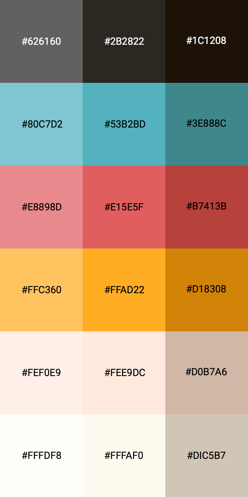
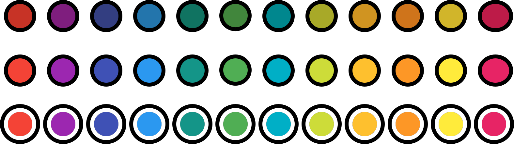
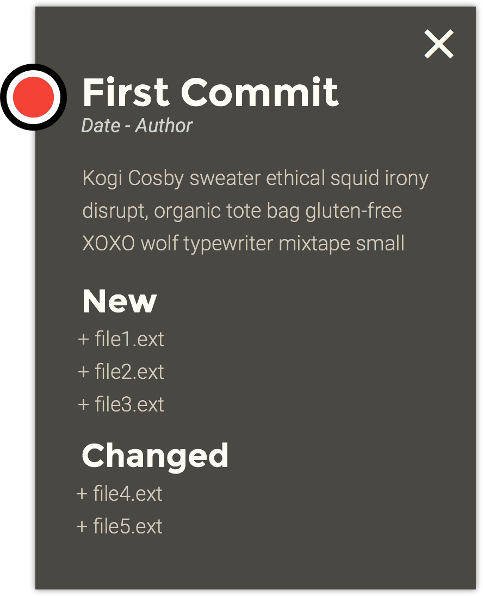
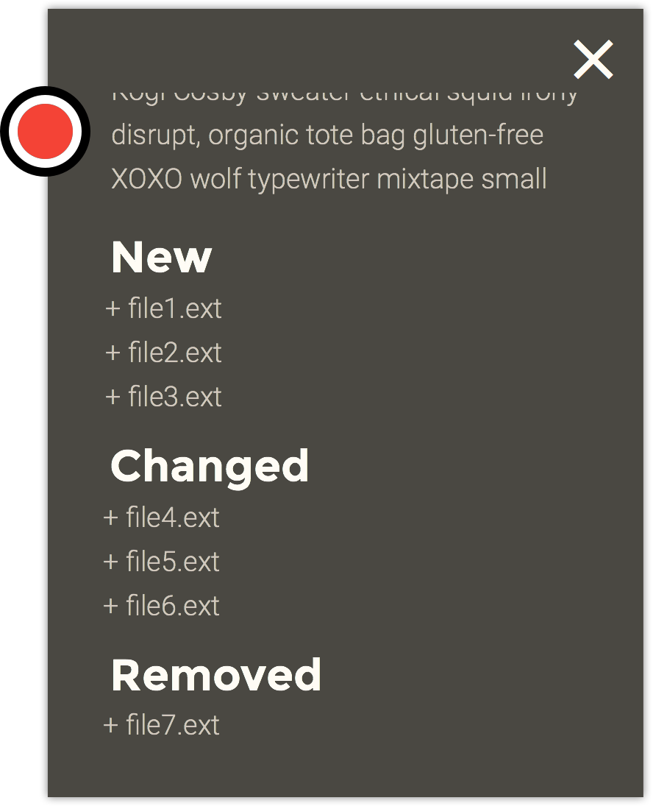
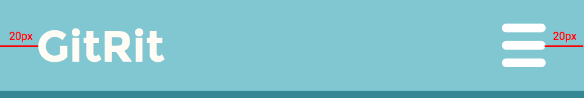
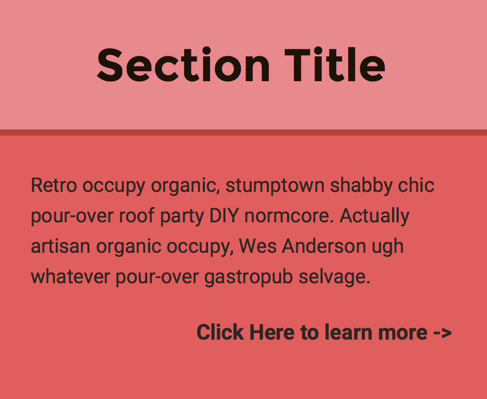
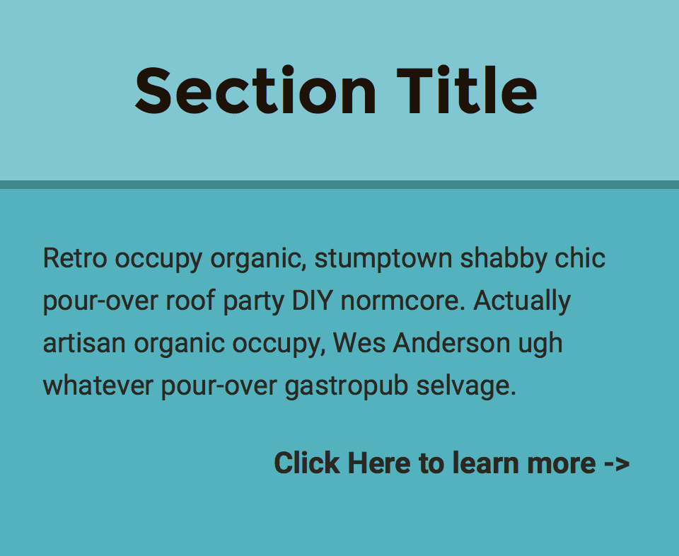
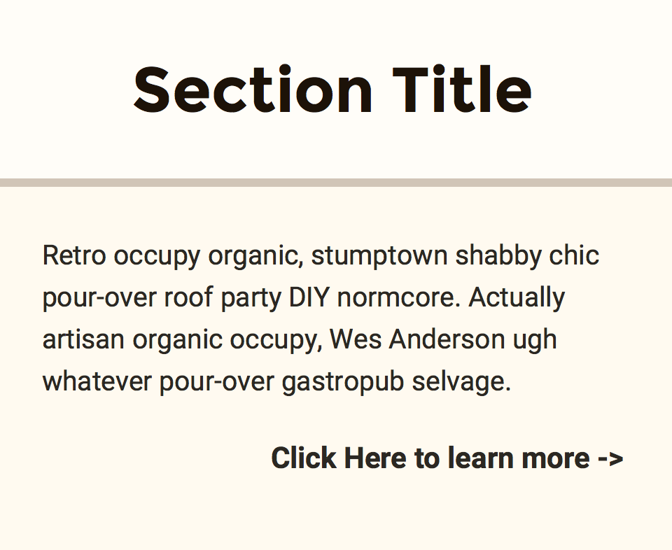
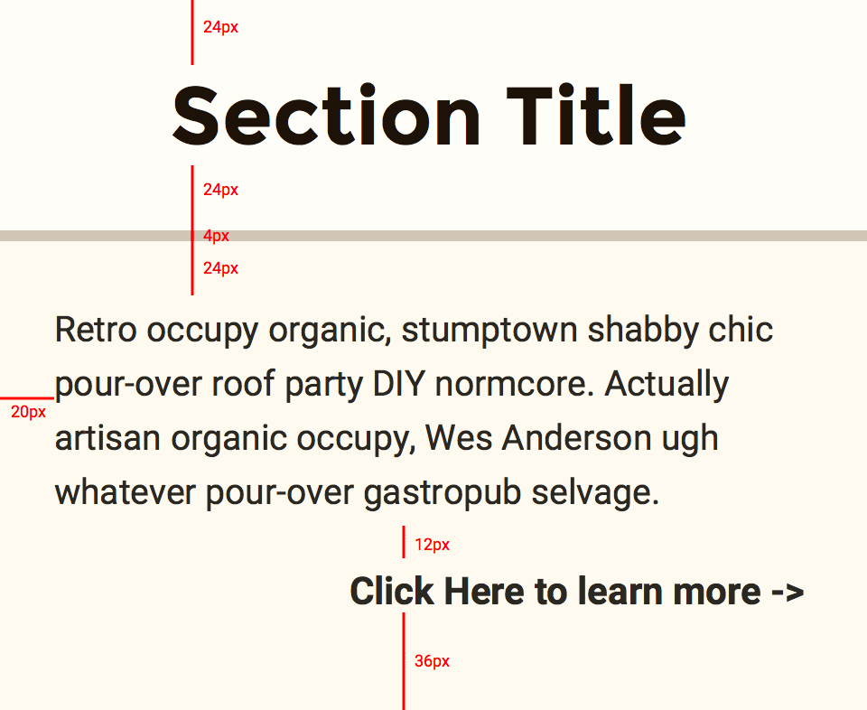
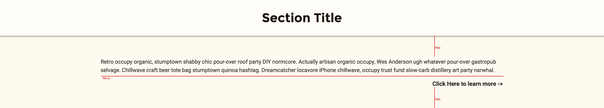

# Designs
A detailed breakdown of the different designs

## Table of Contents
All design elements are organized according to [Atomic Design](http://bradfrost.com/blog/post/atomic-web-design/). Basic elements like colors and links are Atoms. Reusable combinations of atoms are Molecules and large sections are  

1. [Atoms](#atoms)
    1. [Colors](#colors)
    2. [Graph Nodes](#graphnodes)
2. [Molecules](#molecules) 
    1. [Info Modal](#infomodal)
3. [Organisms](#organisms)
    1. [Header](#header)
    2. [Sections](#sections)

## Atoms

### Colors

The site uses a bright color palette inspired by Google's [Material Design](https://www.google.com/design/spec/style/color.html). The center column is the base color. Each one has a light and dark variant.

### Graph Nodes

These are the nodes that will be used in the graph. There are 12 base colors, which is what will be displayed by default. There is a dimmed variant and an active variant for each color. Each node is **25px in diameter** with a border that is **4px thick.**

## Molecules

### Info Modal

**Fonts**

 + _Main Header:_ Montserrat Bold (24px)
 + _Subheaders:_ Montserrat Bold (20px)

**Icons**
 
 + _Close:_ **30px x 30px**

This is the Modal that is displayed when a User clicks on or taps a node. The background is at **85% opacity** so that the graph displays behind it. The color of the node is based on the color of the node that was clicked. The Modal can be dismissed either by clicking on the "X" button , or by clicking on a space outside. 

The Modal has a fixed height of **350px** and a fixed width of **270px** on all devices. As a result, all of the content may not be able to fit. To fix this, the User can scroll through the content of the modal. The ideas of the 

## Organisms

### Header

 
**Fonts**

 + _Header:_ Montserrat Bold (24px)
 + _Navigation:_ Montserrat Regular (24px)

**Icons**

 + _Sandwich Menu:_ **24px width x 25px height** (only in mobile view)
 

This is the header of the page. The title is **20px** from the left and the menu is **20px** from the right. 

Once the device width has expanded to tablet width (**768px**), the menu becomes a list of links, spaced **15px** apart, to each section. All content is vertically centered.

### Sections

 
**Fonts**

 + _Header:_ Montserrat Bold (30px)
 + _Body:_ Roboto Regular (13px)

 
Content can be placed in different sections. Each section is described in a title, which is placed in the header section. Header text is horizontally centered and has a top and bottom margin of **24px**. The header has a bottom border that is **4px** thick. 

Body contents are **24px** from the bottom of the header, **36px** from the bottom of section, and **20px** from the edges. There is a 12px spacing between pieces of content.

 
The rules for the section change when it gets large enough. When the screen expands beyond tablet view (**768px**), content is spaced **50px** from the top and bottom of the section. Content has a maximum of width of 960px and will be be horiontally centered after it reaches that point.