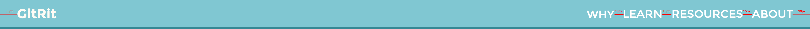

# Designs
A detailed breakdown of the different designs

## Header

This is the header of the page. The title is 30px from the left and the menu is 30px from the right. Once the device width has expanded to tablet width (768px), the menu becomes a list of links to the section. All content is vertically centered.