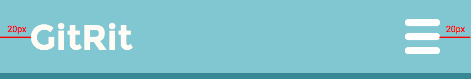
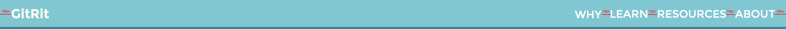
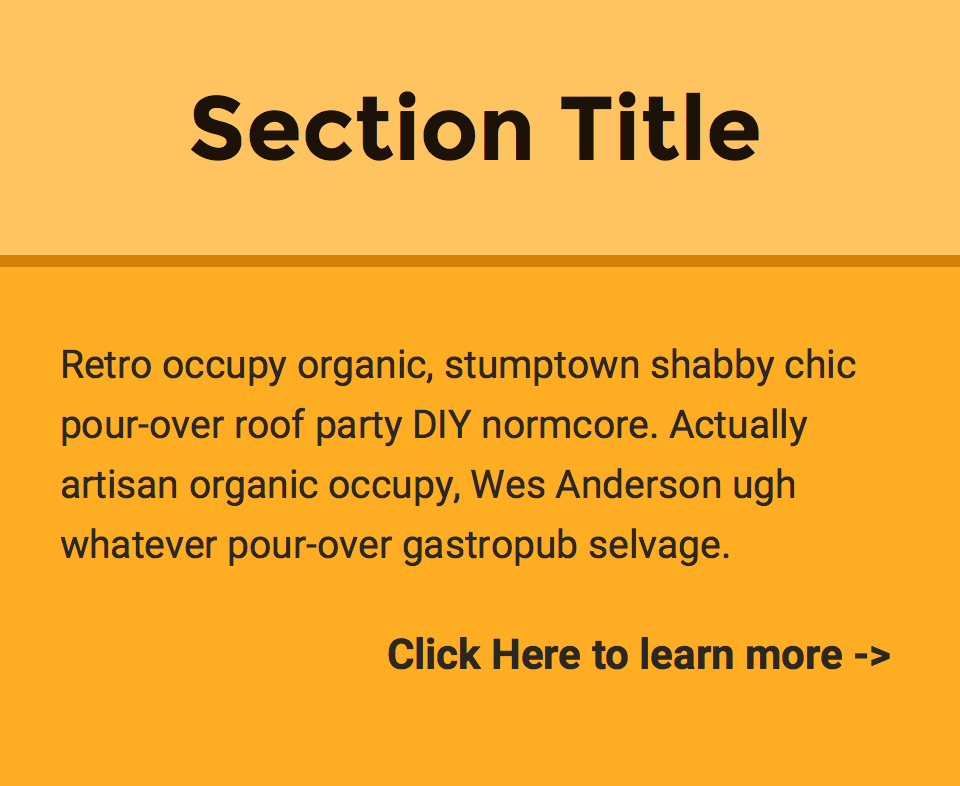
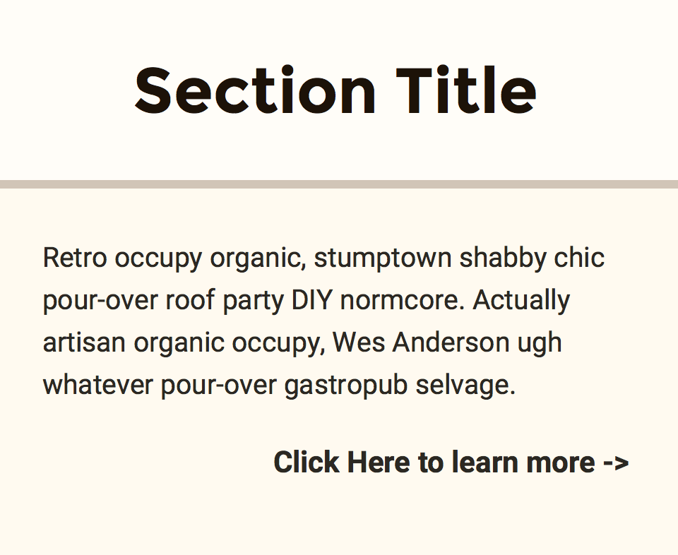
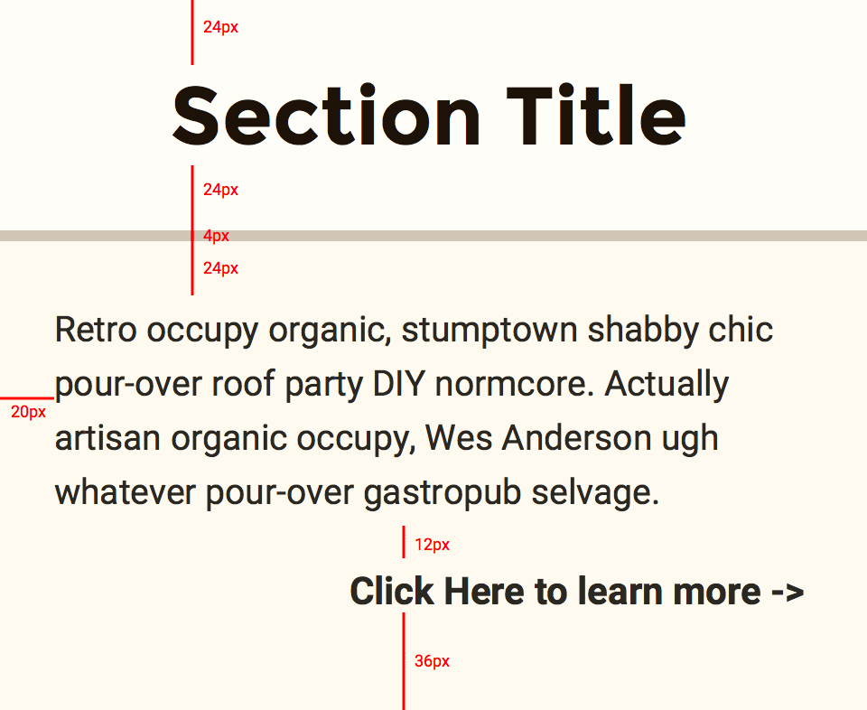
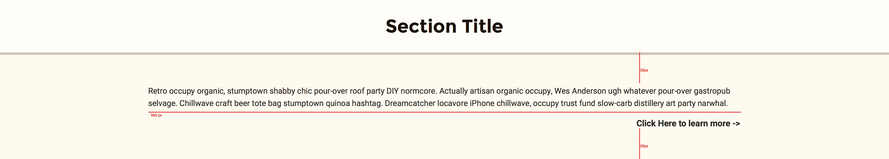

# Designs
A detailed breakdown of the different designs

## Header

 
**Fonts**

 + _Header:_ Montserrat Bold (24px)
 + _Navigation:_ Montserrat Regular (24px)

**Icons**

 + _Sandwich Menu:_ **24px width x 25px height** (only in mobile view)
 

This is the header of the page. The title is **20px** from the left and the menu is **20px** from the right. 

Once the device width has expanded to tablet width (**768px**), the menu becomes a list of links, spaced **15px** apart, to each section. All content is vertically centered.

## Sections

 
**Fonts**

 + _Header:_ Montserrat Bold (30px)
 + _Body:_ Roboto Regular (13px)

 
Content can be placed in different sections. Each section is described in a title, which is placed in the header section. Header text is horizontally centered and has a top and bottom margin of **24px**. The header has a bottom border that is **4px** thick. 

Body contents are **24px** from the bottom of the header, **36px** from the bottom of section, and **20px** from the edges. There is a 12px spacing between pieces of content.

 
The rules for the section change when it gets large enough. When the screen expands beyond tablet view (**768px**), content is spaced **50px** from the top and bottom of the section. Content has a maximum of width of 960px and will be be horiontally centered after it reaches that point.
